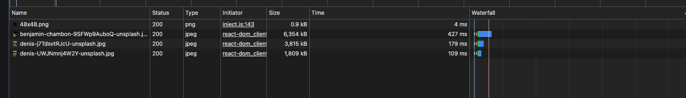
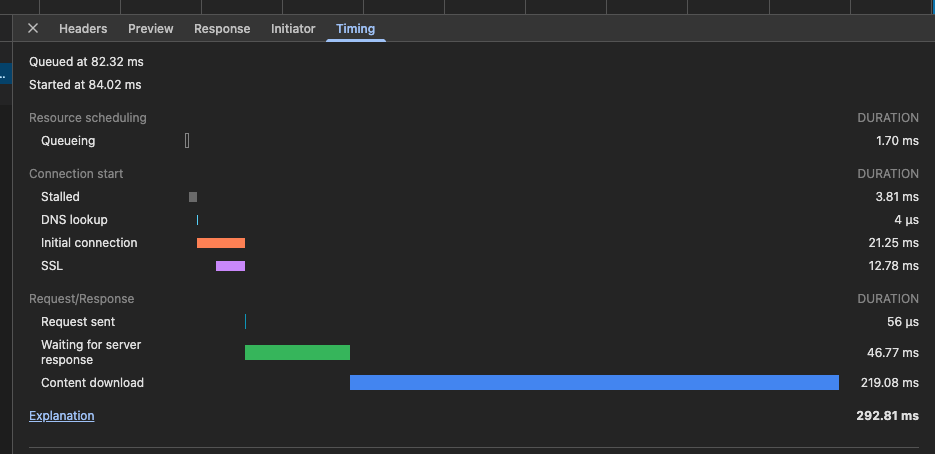
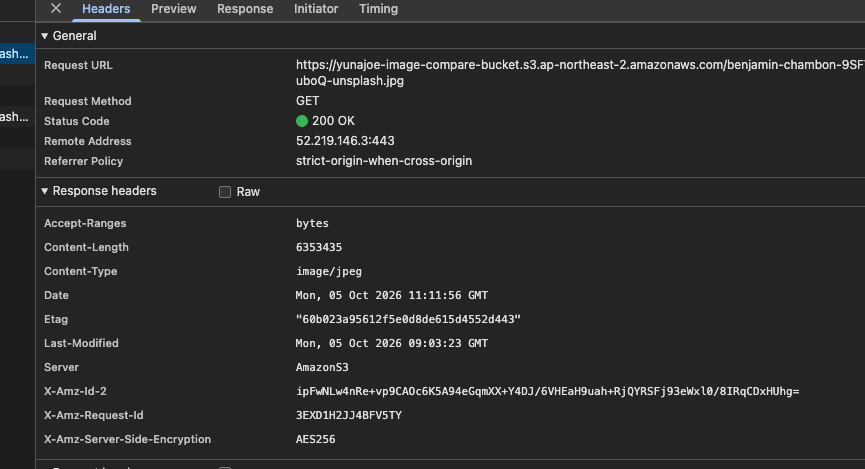
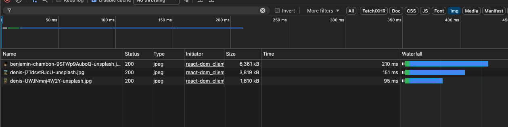
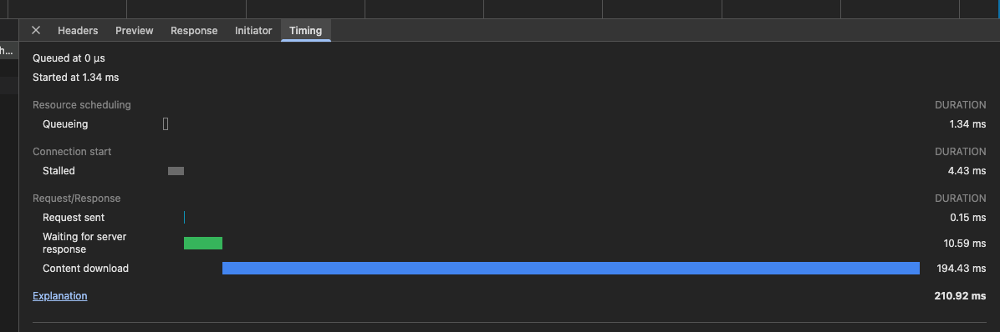
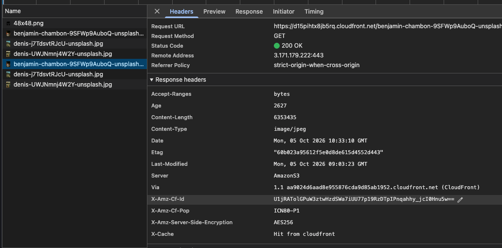

# **AWS S3** 와 AWS CloudFront(CDN)

## 1. AWS S3 (Simple Storage Service) 란?

- **개념:** 무한히 확장 가능한 클라우드 스토리지(파일 저장소)입니다. 이미지고, 동영상이고, 정적 웹 파일이든 차곡차곡 쌓아두는 '거대한 창고' 역할을 합니다.
- **작동 원리:**

1. 사용자가 이미지를 요청하면, 전 세계에 몇 개 없는 특정 AWS 리전(예: 서울 `ap-northeast-2`)에 위치한 S3 서버가 직접 요청을 받습니다.
2. 서버가 직접 하드디스크(저장소)에서 파일을 찾아 사용자에게 곧바로 전송해 줍니다.

- **특징:** 원본 데이터를 안전하게 보관하는 데 최적화되어 있지만, 사용자와 물리적으로 멀리 떨어져 있거나 요청이 한꺼번에 몰리면 지연 시간(Latency)이 길어질 수 있습니다.

## 2. AWS CloudFront (CDN) 란?

- **개념:** 전 세계 사용자에게 콘텐츠를 빠르고 안전하게 전달하기 위한 **콘텐츠 전송 네트워크(Content Delivery Network)** 서비스입니다. S3 앞에 세워두는 '스마트한 대형 체인점(배달 거점)'이라고 생각하시면 됩니다.
- **작동 원리 (Edge Location):**

1. CloudFront는 전 세계 수많은 지역에 '엣지 로케이션(Edge Location)'이라는 고성능 캐시 서버들을 두고 있습니다.
2. **최초 요청 (Cache Miss):** 사용자가 이미지를 요청했을 때 인근 엣지 서버에 데이터가 없으면, 엣지 서버가 원본 S3에 대신 가서 파일을 가져온 뒤 사용자에게 전달하고 자기 자신에게도 복사본을 저장(**캐싱**)합니다.
3. **이후 요청 (Cache Hit):** 다른 사용자(또는 같은 사용자)가 또 요청을 보내면, S3까지 멀리 가지 않고 **사용자와 가장 가까운 엣지 서버에 저장된 복사본을 즉시 반환**합니다. (이때 속도가 엄청나게 빨라집니다.)

- **특징:** 원본 서버(S3)의 부하를 획기적으로 줄여주고, 물리적 거리가 먼 사용자에게도 빠른 속도로 콘텐츠를 제공할 수 있습니다.

## 3. S3 vs CloudFront 핵심 비교 요약

| 구분               | AWS S3 (원본 저장소)                            | AWS CloudFront (CDN)                                |
| ------------------ | ----------------------------------------------- | --------------------------------------------------- |
| **역할**           | 데이터를 안전하게 **저장(Storage)**             | 데이터를 빠르고 넓게 **전송(Delivery)**             |
| **서버 위치**      | 특정 단일 리전 (예: 서울 리전)                  | 전 세계 수백 개의 **엣지 로케이션(Edge)**           |
| **속도 (Latency)** | 물리적 거리와 서버 부하에 영향 받음             | 사용자 인근 엣지 서버에서 즉시 응답 (**빠름**)      |
| **비용 효율**      | 트래픽이 몰리면 S3 대역폭 비용이 증가할 수 있음 | 캐싱을 통해 원본 호출을 줄여 비용 절감 효과 탁월    |
| **주요 용도**      | 파일의 영구 보관 및 백업                        | 정적 웹사이트 호스팅, 이미지/동영상 스트리밍 서비스 |

# S3 vs AWS CloudFront(CDN) 성능 비교 결과

프로젝트 내에서 원본 S3 서버 직접 호출 방식과 AWS CloudFront CDN 적용 방식을 비교한 결과입니다.

## 1. 전체 로딩 시간(Total Time) 비교

동일한 이미지(약 6.3MB의 `benjamin` 이미지 기준)를 불러올 때 소요된 총 로딩 시간입니다.

- **S3 원본 직통 호출 (`.s3.ap-northeast-2.amazonaws.com`):**
- **약 427 ms** 소요

- **AWS CloudFront 적용 (`.cloudfront.net`):**
- **약 210 ms** 소요

- **결과:** CDN을 적용했을 때 로딩 시간이 **약 50% 이상 단축**되어 훨씬 빠른 이미지를 렌더링할 수 있음을 확인했습니다.

## 2. 네트워크 타이밍(Timing) 상세 분석

두 방식의 세부 요청 처리 과정을 비교하면 CDN이 빠른 이유를 명확하게 알 수 있습니다.

| 항목           | S3 직통 호출 | CloudFront (CDN) | 분석 및 차이점 |
| -------------- | ------------ | ---------------- | -------------- |
| **DNS Lookup** | 약 4 µs      |

| 생략 또는 단축 | S3는 AWS 리전 도메인을 직접 조회하지만, CDN은 가까운 엣지 서버(Edge Location)를 경유합니다. |
| **Initial Connection / SSL** | 약 21 ms / 12 ms

| 최적화됨 | HTTPS 핸드셰이크 과정이 사용자 인접 엣지 서버에서 처음에 빠르게 마무리됩니다. |
| **Waiting for server response (TTFB)** | 약 46.77 ms

| **약 10.59 ms**  | **가장 큰 차이점!** 서버가 첫 응답을 주는 시간(TTFB)이 원본 S3(46ms)에 비해 CDN(10ms)이 압도적으로 빠릅니다. |
| **Content download** | 약 219.08 ms

| 약 194.43 ms

| 실제 컨텐츠를 다운로드하는 전송 속도 역시 CDN 엣지 서버의 고속 네트워크망 덕분에 단축되었습니다. |

## 3. 응답 헤더(Response Headers)로 보는 CDN 동작 확인

CloudFront 응답 헤더(`Headers`) 탭을 통해 캐싱 상태를 검증할 수 있습니다.

- **`Via` 헤더:** `1.1 aa9024d6aad8e955876cda9d85ab1952.cloudfront.net (CloudFront)` 값을 통해 정상적으로 CloudFront 배포판을 거쳐 응답이 오고 있음을 증명합니다.

- **`X-Cache` 헤더:** `Hit from cloudfront`
- 엣지 서버에 캐시된 데이터가 사용자에게 성공적으로 적중(`Hit`)하여, 오리진(S3)까지 가지 않고도 빠르게 응답을 내려주었음을 뜻합니다.

## 4. S3 vs cloud front (이미지 비교)

### S3

1. Time
   

2. Timing

3. Response Headers

### cloud front

1. Time

2. Timing

3. Response Headers

